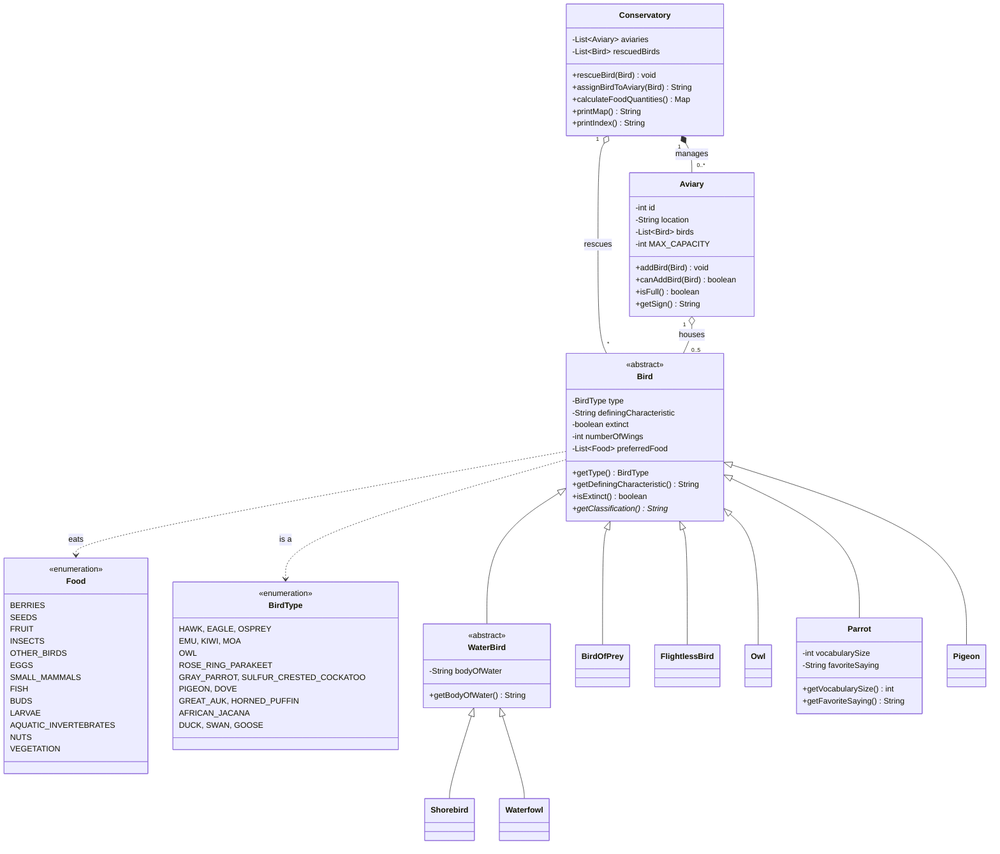

# Bird Conservatory Management System

## 👋 Welcome

Welcome to the **Bird Conservatory Management System**! This application is designed to help conservationists, zookeepers, and bird enthusiasts manage a complex sanctuary for our feathered friends. Whether you're rescuing a stray duck or finding a home for a majestic eagle, this system handles the logistics so you can focus on the birds.

The system is built to track various bird species, manage their dietary needs, and ensure they are housed safely in appropriate aviaries (we wouldn't want to put a Hawk in with a Dove!).

---

## 🗺️ System Architecture

To help you visualize how the pieces fit together, here is a diagram of the system's "DNA". It shows how we define birds, how aviaries hold them, and how the conservatory manages it all.



---

## 🦜 Meet the Birds

Our system isn't just a database; it understands that every bird is unique.

### The `Bird` Family
At the heart of the system is the **Bird** class. Every bird has some basic traits:
- **Type**: What species is it? (e.g., Hawk, Duck)
- **Characteristics**: What makes it special? (e.g., "Sharp talons")
- **Diet**: What does it eat? (e.g., Seeds, Fish)
- **Wings**: Because while most have 2, accidents happen, and we need to track that.
- **Extinct Status**: Sadly, we sometimes track birds that are no longer with us, like the Great Auk.

We then have tailored families:
*   **🦅 Birds of Prey**: Hunters like Hawks and Eagles. They contain special logic to ensure they aren't housed with potential "snacks".
*   **🌊 Water Birds**: Includes **Waterfowl** (Ducks/Swans) and **Shorebirds** (Puffins), which also track which body of water they love.
*   **🦜 Parrots**: Our chatty friends! We specifically track how many words they know and their favorite saying.
*   **🏃 Flightless Birds**: Emus, Kiwis, and Moas. They live on the ground.
*   **🦉 Owls** and **🕊️ Pigeons**: Independent groups with their own specific behaviors.

---

## 🏠 The Conservatory: A Simulation

The **Conservatory** acts as the central hub. Think of it as the "Brain" of the operation.

### 1. Rescuing Birds
When a bird is brought in, we first "rescue" it. This registers the bird in our system without immediately putting it in a cage. This allows us to assess the bird before finding it a home.

### 2. Housing (The Aviary Logic)
The most complex part of our job is housing. We can't just throw everyone together! The **Aviary** class handles these strict rules:
*   **Capacity**: Maximum of 5 birds per aviary. No overcrowding!
*   **Safety First**: **Birds of Prey** and **Waterfowl** are territorial. They cannot be mixed with other bird types.
*   **Extinct Birds**: We can track extinct birds in our records, but we obviously can't put them in physical aviaries (they would be ghosts!).

### 3. Kitchen Duty
A hungry bird is an unhappy bird. The Conservatory can automatically generate a **Food Order List**. It looks at every bird in every aviary and calculates exactly how much of each food type (Seeds, Fish, Insects, etc.) needs to be ordered.

---

## 🧪 Ensuring It Works (Testing)

We didn't just guess that this would work; we proved it. We used **JUnit** to create a suite of strict tests:

*   **Boundary Testing**: We tried to add a 6th bird to an aviary to make sure the system refused it.
*   **Safety Testing**: We tried to put a Hawk in with a Dove. The system correctly blocked the move.
*   **Logic Testing**: We calculated food orders for complex mixes of birds to ensure the math was perfect.
*   **Search Testing**: We verified that if you stick a Parrot in "Aviary 4", the system can find it instantly.

---

## 💡 Why We Built It This Way

### Why inheritance?
We used a hierarchy (e.g., `Duck` extends `Waterfowl` extends `WaterBird` extends `Bird`) because it mirrors biology. It allows us to write code once (like "all birds eat") and reuse it, while still allowing specific overrides (like "Parrots speak").

### Why is everything private?
You'll see variables like `- type` or `- birds` are locked away (`private`). This is **Encapsulation**. It prevents accidental tampering. You can't just reach in and change a bird's wingspan; you have to ask the bird nicely (use a method).

### Why the "rescue" step?
We separated `rescueBird()` from `assignBirdToAviary()` to mimic real life. Sometimes you receive a bird but don't have a cage ready yet. This two-step process offers flexibility.

---

## File Structure

```
lab-5010/
├── src/
│   ├── birds/
│   │   ├── Bird.java
│   │   ├── BirdOfPrey.java
│   │   ├── FlightlessBird.java
│   │   ├── Owl.java
│   │   ├── Parrot.java
│   │   ├── Pigeon.java
│   │   ├── WaterBird.java
│   │   ├── Shorebird.java
│   │   ├── Waterfowl.java
│   │   ├── BirdType.java
│   │   └── Food.java
│   └── conservatory/
│       ├── Aviary.java
│       └── Conservatory.java
├── test/
│   ├── birds/
│   │   └── BirdTest.java
│   └── conservatory/
│       ├── AviaryTest.java
│       └── ConservatoryTest.java
├── res/
│   └── design_document.md
└── pom.xml
```
